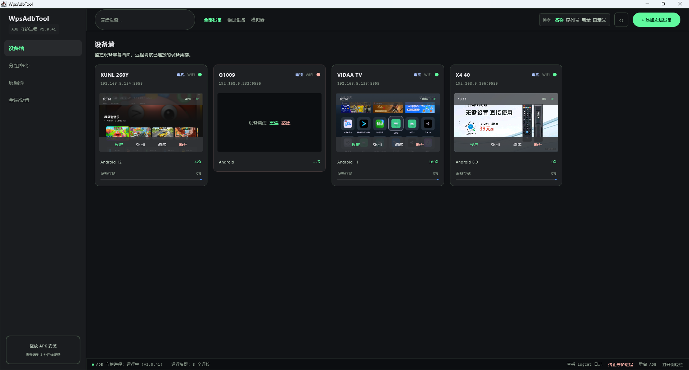
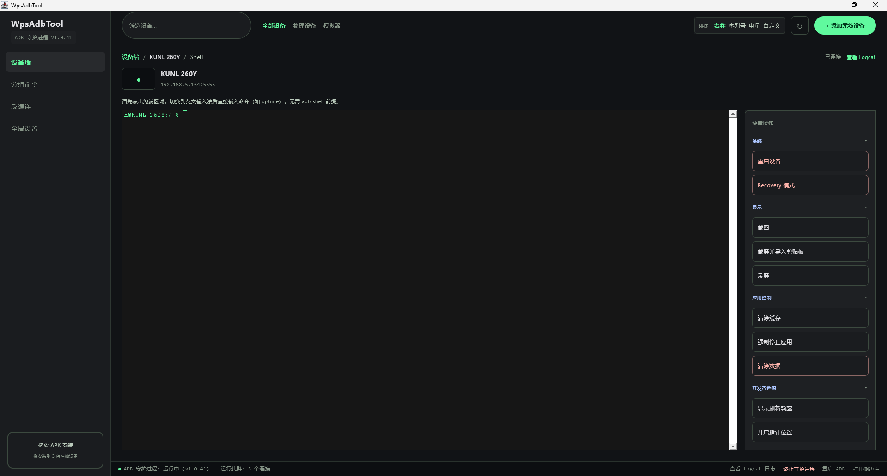
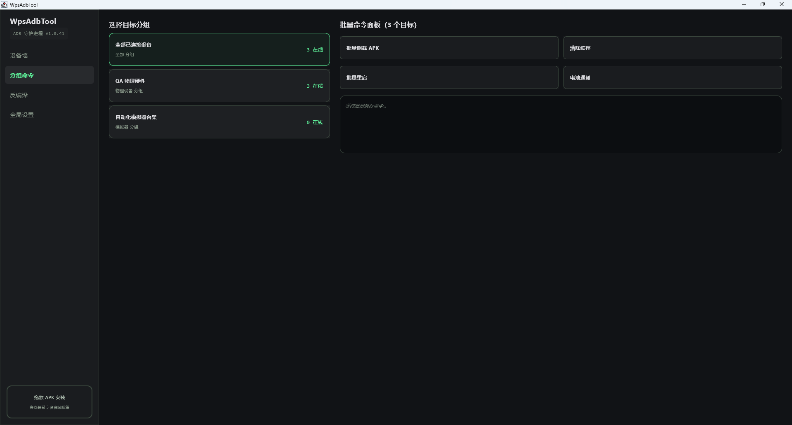
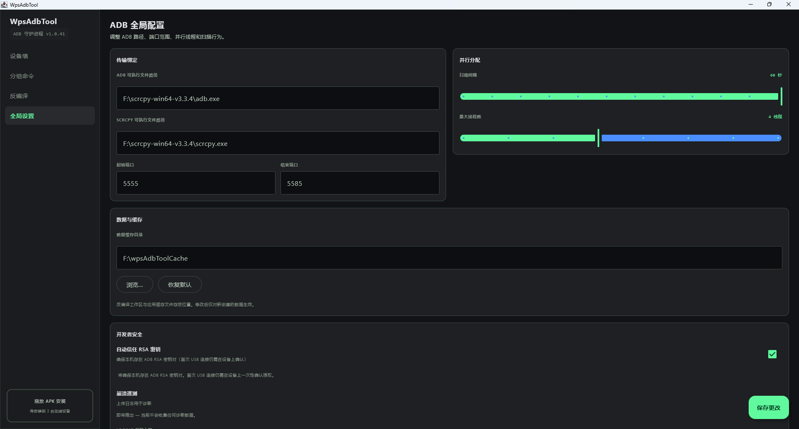
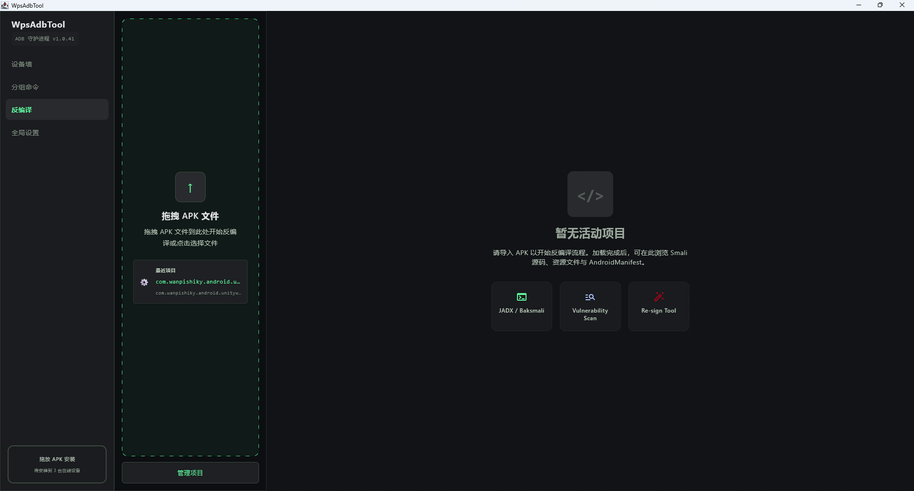
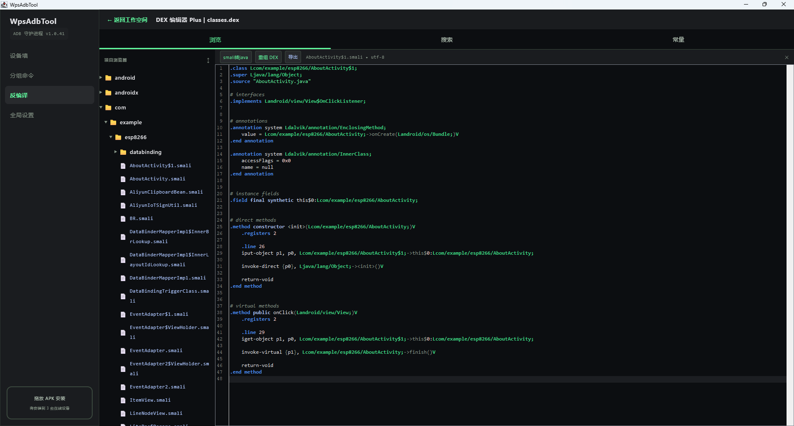

# WpsAdbTool

基于 **Kotlin Multiplatform + Compose Multiplatform** 的 Android 设备集群管理工具。  
从 Web 原型迁移而来，采用 Carbon 深色主题，面向多设备调试、批量运维与 APK 侧载场景。

> **产品定位：** Desktop（Windows / macOS / Linux）为**主力平台**，通过真实 ADB 连接设备；Android App 当前为 **UI 演示**（Mock 数据），不含真实 ADB 能力。

---

## 界面预览

### 设备墙

多设备网格监控：在线/离线状态、屏幕预览、投屏 / Shell / 调试 / 断开，侧栏支持 APK 拖放批量安装。



### Shell 终端

JediTerm 集成终端与右侧快捷操作（重启、截图、清缓存等）；点击终端即可输入命令，无需 `adb shell` 前缀。



### 分组命令

按分组选择目标设备，批量侧载 APK、清除缓存、重启、电池巡测；命令输出实时显示在面板下方。



### 全局设置

ADB / scrcpy 路径、端口范围、扫描间隔与并行线程、数据缓存目录、RSA 自动信任等，保存至 `~/.wps-adb/`。



### Decompile Studio

拖拽或选择 APK 开始反编译；浏览 Smali、资源与 AndroidManifest，管理最近项目。



### DEX 编辑器 Plus

项目浏览器 + Smali 编辑器；支持 Smali→Java、重组 DEX、常量搜索与导出。



---

## 功能概览

### Desktop 已实现

| 模块 | 能力 |
|------|------|
| **设备墙** | 自动扫描与定时刷新；按名称/序列号/电量排序；物理机/模拟器筛选；在线设备截图预览 |
| **设备操作** | 投屏、Shell（JediTerm 终端 + 快捷操作）、重启、断开、离线重连/移除；拖放 APK 单设备安装 |
| **无线配对** | QR 扫码配对（Android 11+ 无线调试）；Legacy 手动 IP + 端口连接 |
| **侧栏投屏** | 调用外部 [scrcpy](https://github.com/Genymobile/scrcpy) 独立窗口；码率/分辨率/FPS 等连接参数可配 |
| **侧栏 AppLog** | APK 安装后自动开标签；打开应用、卸载、按包名 logcat 监听、级别过滤 |
| **分组命令** | 对分组内在线设备批量：侧载 APK、清除应用缓存（可指定包名）、重启、读取电池信息 |
| **APK 安装** | 侧栏/设备墙拖放；批量安装到全部在线设备；包名解析（aapt / apkanalyzer / 文件名降级） |
| **Logcat 控制台** | 底部托盘双标签：**事件**（操作日志）与 **Logcat**（真实 `adb logcat` 流）；Shell 按钮聚焦单设备 |
| **全局设置** | ADB / scrcpy 路径、端口范围、扫描间隔、并行线程、日志保留条数；设置持久化到 `~/.wps-adb/` |
| **ADB 守护进程** | 底栏显示状态；支持终止 / 重启 ADB Server |
| **Decompile Studio** | APK 导入、资源浏览、编辑保存、DEX→Smali/Java、DexEditor++（多 DEX/搜索/常量/导出）、**改码回编**（Smali→DEX 重组、重打包、debug 签名导出 APK）、常量写回 Smali、单文件 Smali→Java；**未实现**：DEX→JAR/修复、包名替换、控制流混淆 |

### Android App

- 共享 Compose UI，使用 `MockAdbRepository` 演示界面流程  
- **不含**真实 ADB、scrcpy、QR 配对后端（刻意搁置，见 `docs/superpowers/specs/2026-06-11-remaining-work-backlog.md`）

### 明确未实现（远期）

- SidePanel 内嵌 scrcpy 视频流  
- SidePanel 内嵌 scrcpy 视频流（Desktop 已支持外部 scrcpy 窗口）  
- 崩溃遥测上报（设置页已标注「即将推出」）  
- Legacy 局域网自动扫描（保留手动 IP 输入）  
- Decompile Studio 高级工具（DEX→JAR/修复、包名替换）— 改码回编已实现，见上表

---

## 环境要求

| 依赖 | 说明 |
|------|------|
| **JDK 17** | 编译与运行 Desktop；打包安装包需完整 JDK（含 `jlink` / `jpackage`） |
| **Android SDK** | 可选；用于 `aapt` / `apkanalyzer` 解析 APK 包名 |
| **adb** | 需在 PATH 中，或在设置页指定绝对路径 |
| **scrcpy** | 可选；投屏功能需要，可在设置页配置路径 |

### 设置持久化

Desktop 配置保存在：

```
~/.wps-adb/settings.properties
```

无线设备连接信息保存在同目录下的 JSON 存储中，应用重启后自动重连。

---

## 快速开始

### 运行 Desktop

```bash
# 标准运行
./gradlew :desktopApp:run

# 热重载开发（Compose Hot Reload）
./gradlew :desktopApp:hotRun --auto
```

> Windows 下使用 `gradlew.bat`。若 IDEA 运行失败，请确认 Gradle JVM 为 **JDK 17**，且 `:shared` 已编译。

### 构建安装包

```bash
# 当前平台（Windows → MSI，macOS → DMG，Linux → Deb）
./gradlew :desktopApp:packageReleaseDistributionForCurrentOS

# 或指定格式
./gradlew :desktopApp:packageReleaseMsi    # Windows
./gradlew :desktopApp:packageReleaseDmg    # macOS
./gradlew :desktopApp:packageReleaseDeb    # Linux
```

产物目录：`desktopApp/build/compose/binaries/main-release/`

macOS 签名、公证与 CI 打包见 [docs/macos-ci.md](./docs/macos-ci.md)。Windows CI 打包见 [docs/windows-ci.md](./docs/windows-ci.md)。

### 运行 Android

```bash
./gradlew :androidApp:assembleDebug
```

### 运行测试

```bash
# Desktop / JVM 单元测试
./gradlew :shared:jvmTest

# Android Host 测试
./gradlew :shared:testAndroidHostTest
```

---

## 使用提示

1. **首次使用：** 打开「全局设置」，确认 `adb` 路径正确；若需投屏，配置 `scrcpy` 路径并保存。  
2. **添加无线设备：** 顶栏「+ 添加无线设备」→ 选择 QR 配对或 Legacy IP 连接。  
3. **投屏：** 设备墙点击「投屏」→ 侧栏 Mirror 标签自动启动 scrcpy 外部窗口。  
4. **Shell 终端：** 设备墙点击 **Shell** → 共享元素转场进入 JediTerm 控制台与右侧快捷操作面板。  
5. **查看 Logcat：** 侧栏/底栏打开 Logcat 控制台 → 切换到 **Logcat** 标签；Shell 视图内也可「查看 Logcat」聚焦当前设备。  
6. **批量运维：** 导航至「分组命令」，选择目标分组后执行批量操作。  
7. **USB + WiFi 双连接：** 同一台手机若 USB 与无线同时在线，设备墙会自动按硬件序列号去重，优先展示 WiFi 条目。

---

## 项目结构

```
WpsAdbTool/
├── desktopApp/          # Desktop 入口（Compose Desktop）
├── androidApp/          # Android 入口
├── shared/              # KMP 共享模块
│   ├── commonMain/      # UI、ViewModel、模型、Mock 实现
│   ├── jvmMain/         # Desktop 真实 ADB、scrcpy、设置持久化
│   └── androidMain/     # Android 平台适配（Mock）
├── docs/superpowers/    # 设计规格与实施计划
├── wpsAdbToolForWeb/    # 已归档的 React UI 原型（仅作设计参考）
└── scripts/macos/       # macOS 签名脚本
```

共享 UI 与业务逻辑位于 [`shared/src/commonMain`](./shared/src/commonMain/kotlin)；Desktop 专属 ADB 实现在 [`shared/src/jvmMain`](./shared/src/jvmMain/kotlin)。

---

## 设计文档

| 文档 | 内容 |
|------|------|
| [Web → KMP 迁移](./docs/superpowers/specs/2026-06-09-web-to-kmp-design.md) | 主界面迁移范围 |
| [SidePanel 标签栏](./docs/superpowers/specs/2026-06-10-side-panel-tabs-design.md) | Mirror + AppLog 侧栏 |
| [scrcpy 投屏桥接](./docs/superpowers/specs/2026-06-11-scrcpy-bridge-design.md) | 外部窗口投屏 |
| [QR 无线配对](./docs/superpowers/specs/2026-06-11-qr-wireless-pairing-design.md) | 扫码配对流程 |
| [全局 Logcat / Shell](./docs/superpowers/specs/2026-06-11-global-logcat-shell-design.md) | Logcat 控制台与 Shell 聚焦 |
| [Backlog](./docs/superpowers/specs/2026-06-11-remaining-work-backlog.md) | 未完成项与路线图 |

---

## Web 原型（归档）

[`wpsAdbToolForWeb/`](./wpsAdbToolForWeb/) 为早期 React 界面原型，**不参与构建与发布**。当前产品目标为 Compose Multiplatform（Desktop + Android 演示）。

---

## 许可证

见仓库根目录 LICENSE（如有）或各模块声明。scrcpy 为独立第三方工具，需用户自行下载并遵守其许可证。
